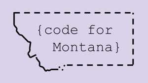
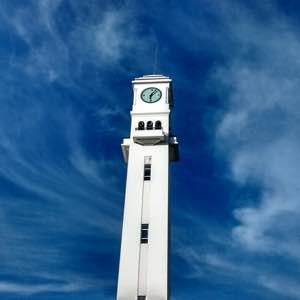
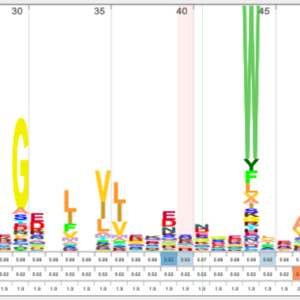

The homepage of George Lesica. I'm a resident of Missoula, MT, one of the most remarkable cities in
the world (in my opinion). I'm a software developer and recovering economist. I enjoy hiking,
running, riding my bike to work, craft beer, and fancy programming languages.

  - [Blog](http://goto10line.net)
  - [Email](mailto:george@lesica.com)
  - [GitHub](https://github.com/glesica)
  - [Instagram](https://www.instagram.com/georgelesica) (New!)
  - [Keybase](https://keybase.io/glesica)
  - [LinkedIn](https://www.linkedin.com/in/george-lesica)

I also have a page of interesting [quotes](quotes.html). Well, interesting to me, anyway.

Feel free to reach out via email or LinkedIn if you want to talk. I especially enjoy helping young
people get started in the software industry. I have acted as a mentor on several occasions and I
devote a significant amount of time to outreach and recruiting. I am also particularly passionate
about increasing diversity and representation in the computing field.

Below you'll find an outline of some of the things that make me "tick". Projects, either ongoing or
complete, with which I am proud to be associated.

## Noteworthy Projects

**Co-organizer, Missoula Tech** - A group of tech industry folks in a wide variety of roles from
across Montana, centered in Missoula, MT. We organize social, educational, and technical events.
There's also an active Slack workspace. Come check us out at
[https://missoula.tech/](https://missoula.tech/).

**Co-founder, Code for Montana** - A chapter of the [Code for
America](https://www.codeforamerica.org/) organization focused on issues and problems that are
important to Montanans. Right now we're involved in a project to improve access to, and collaboration
between non-profit organizations. We are also involved in an ongoing project to improve the
technical literacy of staff at local non-profits through personalized training and consultation
provided by tech industry volunteers.

**Co-author, The Economics of Seinfeld** - A web site that uses clips from the popular '90s sitcom
"Seinfeld" to teach economics. The site is used widely at the high school and university levels and
has helped inspire a whole sub-genre of economics teaching tools based on pop culture. Check out
the site at [http://yadayadayadaecon.com](http://yadayadayadaecon.com) or the
[publication](https://econpapers.repec.org/article/tafjeduce/v_3a42_3ay_3a2011_3ai_3a3_3ap_3a317-318.htm)
in the Journal of Economic Education.

**Co-founder, Datamaglia** - A recommender system startup a friend of mine and I did awhile back. We
built some pretty neat technology on top of a graph database and got to participate in [Start-Up
Chile](https://www.startupchile.org), which meant that we got to live in Santiago, Chile for about
eight months. Alas, we made mistakes, and while we still think our idea was sound (AWS and Azure
have both launched vaguely similar products in the years since) we didn't get sufficient traction.

**Open Source Author and Maintainer** - I have written several mildly popular software packages and
I help maintain a rotating cast of other, more popular, packages. I'm currently the primary
maintainer for the [Testify](https://github.com/stretchr/testify/) testing package for the Go
programming language. I originally wrote the [Julia language
driver](https://github.com/glesica/neo4j.jl) for the Neo4j database, although it has since been
forked and improved by others. I also wrote a tool called
[DCDG](https://github.com/glesica/dcdg.dart) that will automatically generate a class diagram from
Dart source code.

## Day Job

At the moment, I'm employed as a Senior Software Engineer for [Wheeler Lab](http://wheelerlab.org)
at the [University of Montana](http://www.umt.edu). Most of our work involves applying machine
learning techniques to bioinformatics problems.  In particular, we are working to improve the
accuracy of DNA and protein sequence alignments. This work has broad potential implications in areas
as diverse as agriculture, management of viral epidemics, and the treatment of genetic disorders.

Much of our code is written by student researchers (undergraduate and graduate) who have relatively
little experience building "real" software. My job is twofold. First, make sure that the software
released by the lab is performant, free of serious bugs, and readily usable by the broader
scientific community.  Second, help ensure that our students achieve their educational, research,
and professional goals and (hopefully) learn a little (or a lot) about software development in the
process.

